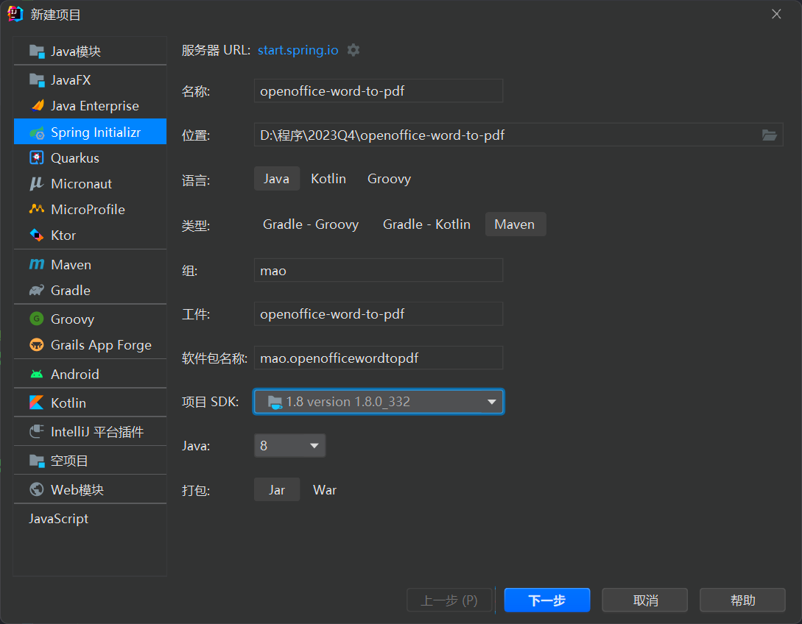
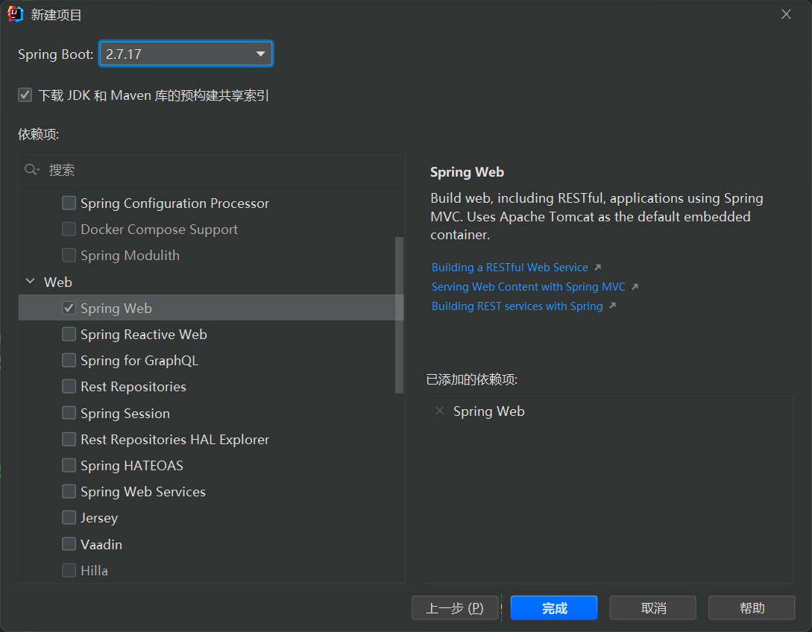
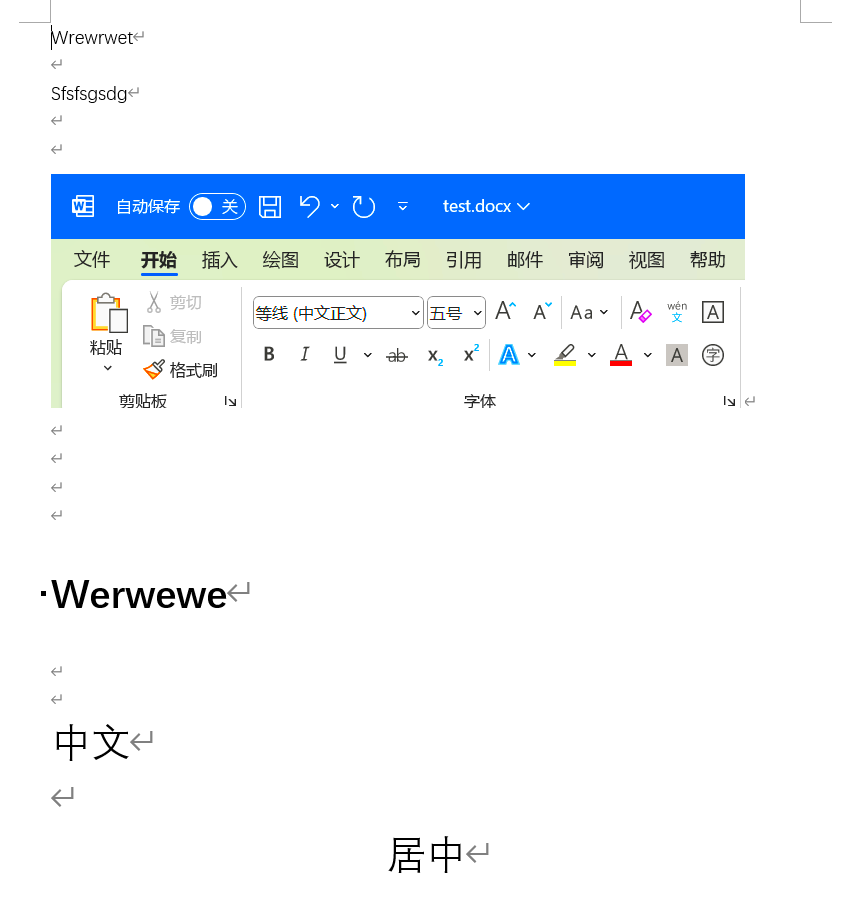
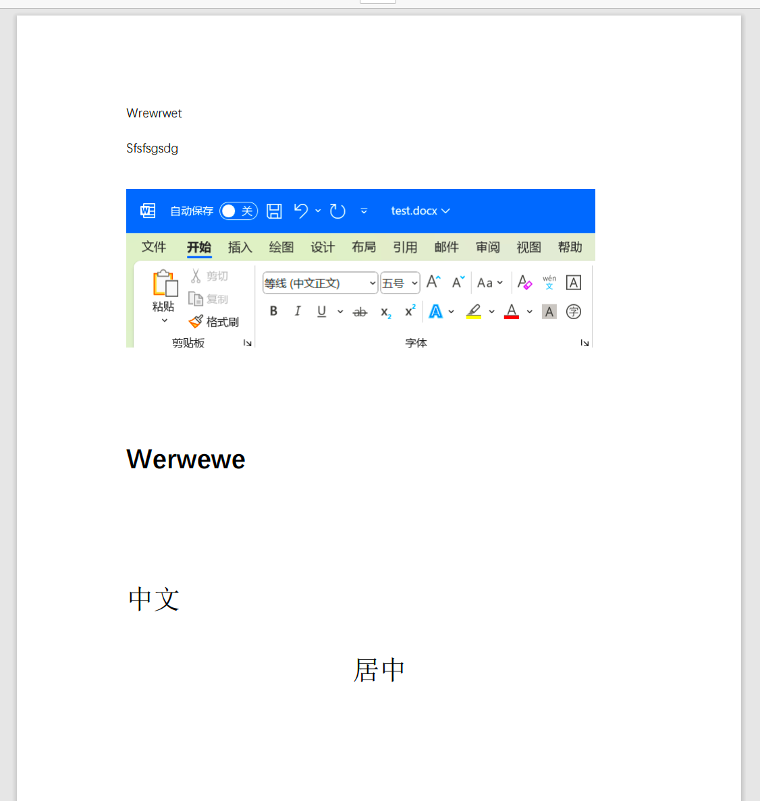
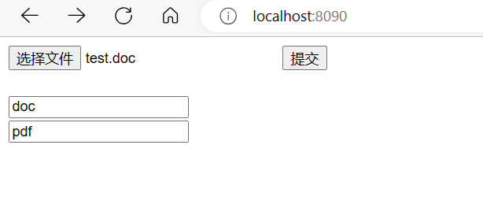
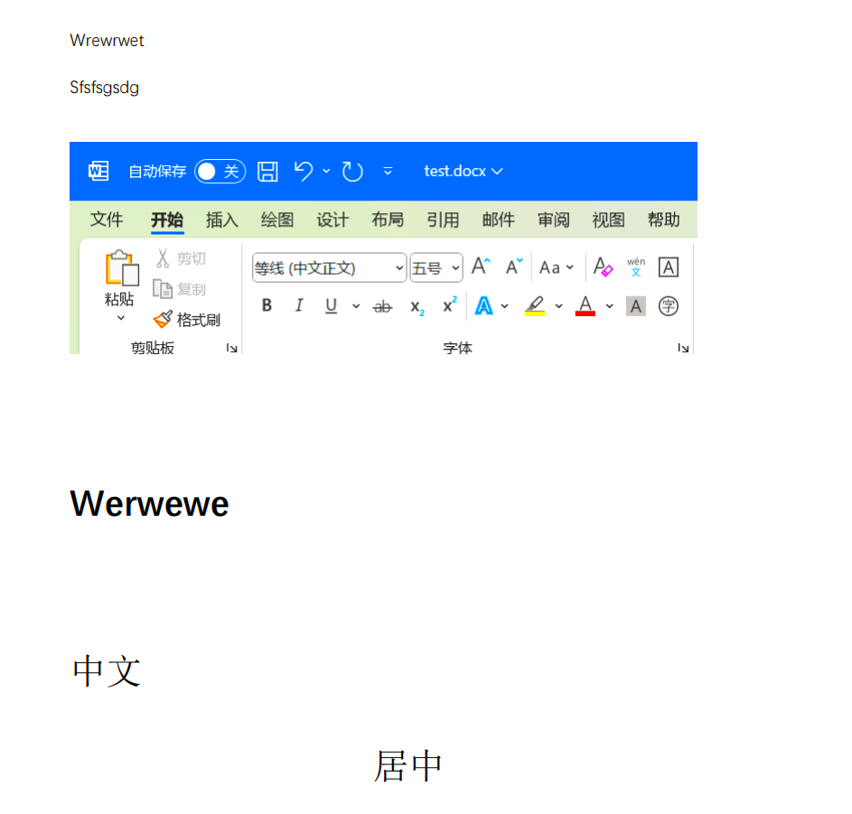

# SpringBoot整合openoffice

## 概述

因业务需要，需要使用SpringBoot将docx文件转换成PDF文件，再将PDF文件响应给用户


## docx转pdf

### 第一步：创建Springboot程序







### 第二步：配置maven

```xml
<?xml version="1.0" encoding="UTF-8"?>
<project xmlns="http://maven.apache.org/POM/4.0.0" xmlns:xsi="http://www.w3.org/2001/XMLSchema-instance"
         xsi:schemaLocation="http://maven.apache.org/POM/4.0.0 https://maven.apache.org/xsd/maven-4.0.0.xsd">
    <modelVersion>4.0.0</modelVersion>
    <parent>
        <groupId>org.springframework.boot</groupId>
        <artifactId>spring-boot-starter-parent</artifactId>
        <version>2.7.1</version>
        <relativePath/> <!-- lookup parent from repository -->
    </parent>
    <groupId>mao</groupId>
    <artifactId>openoffice-word-to-pdf</artifactId>
    <version>0.0.1-SNAPSHOT</version>
    <name>openoffice-word-to-pdf</name>
    <description>openoffice-word-to-pdf</description>
    <properties>
        <java.version>1.8</java.version>
    </properties>
    <dependencies>
        <dependency>
            <groupId>org.springframework.boot</groupId>
            <artifactId>spring-boot-starter-web</artifactId>
        </dependency>

        <dependency>
            <groupId>org.springframework.boot</groupId>
            <artifactId>spring-boot-starter-test</artifactId>
            <scope>test</scope>
        </dependency>

        <!--spring-boot lombok-->
        <dependency>
            <groupId>org.projectlombok</groupId>
            <artifactId>lombok</artifactId>
            <optional>true</optional>
        </dependency>

        <!--spring boot 使用openoffice服务 maven依赖-->
        <!--jodconverter 核心包 -->
        <!-- https://mvnrepository.com/artifact/org.jodconverter/jodconverter-core -->
        <dependency>
            <groupId>org.jodconverter</groupId>
            <artifactId>jodconverter-core</artifactId>
            <version>4.4.6</version>
        </dependency>

        <!--springboot支持包，里面包括了自动配置类 -->
        <!-- https://mvnrepository.com/artifact/org.jodconverter/jodconverter-spring-boot-starter -->
        <dependency>
            <groupId>org.jodconverter</groupId>
            <artifactId>jodconverter-spring-boot-starter</artifactId>
            <version>4.4.6</version>
        </dependency>

        <!--jodconverter 本地支持包 -->
        <!-- https://mvnrepository.com/artifact/org.jodconverter/jodconverter-local -->
        <dependency>
            <groupId>org.jodconverter</groupId>
            <artifactId>jodconverter-local</artifactId>
            <version>4.4.6</version>
        </dependency>
    </dependencies>

    <build>
        <plugins>
            <plugin>
                <groupId>org.springframework.boot</groupId>
                <artifactId>spring-boot-maven-plugin</artifactId>
                <configuration>
                    <image>
                        <builder>paketobuildpacks/builder-jammy-base:latest</builder>
                    </image>
                </configuration>
            </plugin>
        </plugins>
    </build>

</project>

```


### 第三步：编写application.yml配置

```yaml
jodconverter:
  local:
    enabled: true
    # openoffice安装路径
    office-home: 'C:\Program Files (x86)\OpenOffice 4'
    max-tasks-per-process: 10
    #openoffice端口号
    port-numbers: 8100
```


### 第四步：启动服务

如果报以下错误：

```sh
"org.jodconverter.office.OfficeException: A process with acceptString 'socket,host=127.0.0.1,port=8100,tcpNoDelay=1;urp;StarOffice.ServiceManager' started but its pid could not be found"
```


原因：

1. 项目启动目录中带有中文路径
2. soffice的端口异常了不能正常关闭
3. 操作系统环境问题
4. 依赖版本问题


启动成功的控制台日志如下：

```sh
    .   ____          _            __ _ _
   /\\ / ___'_ __ _ _(_)_ __  __ _ \ \ \ \
  ( ( )\___ | '_ | '_| | '_ \/ _` | \ \ \ \
   \\/  ___)| |_)| | | | | || (_| |  ) ) ) )
    '  |____| .__|_| |_|_| |_\__, | / / / /
   =========|_|==============|___/=/_/_/_/
   :: Spring Boot ::                (v2.7.1)

            _____                    _____                   _______
           /\    \                  /\    \                 /::\    \
          /::\____\                /::\    \               /::::\    \
         /::::|   |               /::::\    \             /::::::\    \
        /:::::|   |              /::::::\    \           /::::::::\    \
       /::::::|   |             /:::/\:::\    \         /:::/~~\:::\    \
      /:::/|::|   |            /:::/__\:::\    \       /:::/    \:::\    \
     /:::/ |::|   |           /::::\   \:::\    \     /:::/    / \:::\    \
    /:::/  |::|___|______    /::::::\   \:::\    \   /:::/____/   \:::\____\
   /:::/   |::::::::\    \  /:::/\:::\   \:::\    \ |:::|    |     |:::|    |
  /:::/    |:::::::::\____\/:::/  \:::\   \:::\____\|:::|____|     |:::|    |
  \::/    / ~~~~~/:::/    /\::/    \:::\  /:::/    / \:::\    \   /:::/    /
   \/____/      /:::/    /  \/____/ \:::\/:::/    /   \:::\    \ /:::/    /
               /:::/    /            \::::::/    /     \:::\    /:::/    /
              /:::/    /              \::::/    /       \:::\__/:::/    /
             /:::/    /               /:::/    /         \::::::::/    /
            /:::/    /               /:::/    /           \::::::/    /
           /:::/    /               /:::/    /             \::::/    /
          /:::/    /               /:::/    /               \::/____/
          \::/    /                \::/    /                 ~~
           \/____/                  \/____/
   :: Github (https://github.com/maomao124) ::

2023-11-22 17:48:13.321  INFO 25232 --- [           main] m.o.OpenofficeWordToPdfApplication       : Starting OpenofficeWordToPdfApplication using Java 1.8.0_332 on mao with PID 25232 (D:\程序\2023Q4\openoffice-word-to-pdf\target\classes started by mao in D:\程序\2023Q4\openoffice-word-to-pdf)
2023-11-22 17:48:13.322  INFO 25232 --- [           main] m.o.OpenofficeWordToPdfApplication       : No active profile set, falling back to 1 default profile: "default"
2023-11-22 17:48:13.759  INFO 25232 --- [           main] o.s.b.w.embedded.tomcat.TomcatWebServer  : Tomcat initialized with port(s): 8080 (http)
2023-11-22 17:48:13.764  INFO 25232 --- [           main] o.apache.catalina.core.StandardService   : Starting service [Tomcat]
2023-11-22 17:48:13.764  INFO 25232 --- [           main] org.apache.catalina.core.StandardEngine  : Starting Servlet engine: [Apache Tomcat/9.0.64]
2023-11-22 17:48:13.808  INFO 25232 --- [           main] o.a.c.c.C.[Tomcat].[localhost].[/]       : Initializing Spring embedded WebApplicationContext
2023-11-22 17:48:13.808  INFO 25232 --- [           main] w.s.c.ServletWebServerApplicationContext : Root WebApplicationContext: initialization completed in 465 ms
2023-11-22 17:48:14.057  INFO 25232 --- [er-offprocmng-0] o.j.local.office.OfficeDescriptor        : soffice info (from exec path): Product: OpenOffice - Version: ??? - useLongOptionNameGnuStyle: false
2023-11-22 17:48:14.091  INFO 25232 --- [           main] o.s.b.w.embedded.tomcat.TomcatWebServer  : Tomcat started on port(s): 8080 (http) with context path ''
2023-11-22 17:48:14.095  INFO 25232 --- [           main] m.o.OpenofficeWordToPdfApplication       : Started OpenofficeWordToPdfApplication in 1.005 seconds (JVM running for 1.461)
2023-11-22 17:48:14.157  WARN 25232 --- [er-offprocmng-0] o.j.l.office.LocalOfficeProcessManager   : Profile dir 'C:\Users\mao\AppData\Local\Temp\.jodconverter_socket_host-127.0.0.1_port-8100_tcpNoDelay-1' already exists; deleting
2023-11-22 17:48:14.170  INFO 25232 --- [er-offprocmng-0] o.j.l.office.LocalOfficeProcessManager   : Starting process with --accept 'socket,host=127.0.0.1,port=8100,tcpNoDelay=1;urp;StarOffice.ServiceManager' and profileDir 'C:\Users\mao\AppData\Local\Temp\.jodconverter_socket_host-127.0.0.1_port-8100_tcpNoDelay-1'
2023-11-22 17:48:14.809  INFO 25232 --- [er-offprocmng-0] o.j.local.office.OfficeConnection        : Connected: 'socket,host=127.0.0.1,port=8100,tcpNoDelay=1'
2023-11-22 17:48:14.810  INFO 25232 --- [er-offprocmng-0] o.j.l.office.LocalOfficeProcessManager   : Started process; pid: 11904
```


### 第五步：编写单元测试


```java
package mao.openofficewordtopdf;

import org.jodconverter.core.DocumentConverter;
import org.junit.jupiter.api.Test;
import org.springframework.beans.factory.annotation.Autowired;
import org.springframework.boot.test.context.SpringBootTest;

import java.io.File;

@SpringBootTest
class OpenofficeWordToPdfApplicationTests
{
    @Autowired
    private DocumentConverter documentConverter;

    @Test
    void contextLoads()
    {
        documentConverter.convert(new File("./test.docx")).to(new File("./test.pdf"));
    }

}
```


test.docx内容如下：




运行单元测试，日志输出如下：

```sh
2023-11-22 21:55:57.635  INFO 13336 --- [er-offprocmng-0] o.j.l.office.LocalOfficeProcessManager   : Starting process with --accept 'socket,host=127.0.0.1,port=8100,tcpNoDelay=1;urp;StarOffice.ServiceManager' and profileDir 'C:\Users\mao\AppData\Local\Temp\.jodconverter_socket_host-127.0.0.1_port-8100_tcpNoDelay-1'
2023-11-22 21:55:58.281  INFO 13336 --- [er-offprocmng-0] o.j.local.office.OfficeConnection        : Connected: 'socket,host=127.0.0.1,port=8100,tcpNoDelay=1'
2023-11-22 21:55:58.281  INFO 13336 --- [er-offprocmng-0] o.j.l.office.LocalOfficeProcessManager   : Started process; pid: 35016
2023-11-22 21:55:58.282  INFO 13336 --- [ter-poolentry-1] o.j.local.task.LocalConversionTask       : Executing local conversion task [docx -> pdf]...
```


输出的PDF文件如下：




文件流转换示例：

```java
DocumentFormat documentFormatSrc = documentConverter.getFormatRegistry().getFormatByExtension("docx");
        DocumentFormat documentFormatTarget = documentConverter.getFormatRegistry().getFormatByExtension("pdf");
        documentConverter.convert(
                new FileInputStream(new File("./test.docx")))
                .as(documentFormatSrc)
                .to(new FileOutputStream("./test.pdf"))
                .as(documentFormatTarget).execute();
```


### 第六步：编写文档转换服务

```java
package mao.openofficewordtopdf.service;

import java.io.File;
import java.io.InputStream;
import java.io.OutputStream;

/**
 * Project name(项目名称)：openoffice-word-to-pdf
 * Package(包名): mao.openofficewordtopdf.service
 * Interface(接口名): DocumentConverterService
 * Author(作者）: mao
 * Author QQ：1296193245
 * GitHub：https://github.com/maomao124/
 * Date(创建日期)： 2023/11/23
 * Time(创建时间)： 8:49
 * Version(版本): 1.0
 * Description(描述)： 文档转换服务
 */

public interface DocumentConverterService
{

    /**
     * 文档转换
     *
     * @param sourcePath 来源路径字符串
     * @param targetPath 目标路径字符串
     */
    void converter(String sourcePath, String targetPath);

    /**
     * 文档转换
     *
     * @param sourcePath 来源路径
     * @param targetPath 目标路径
     */
    void converter(File sourcePath, File targetPath);

    /**
     * 文档转换
     *
     * @param inputStream      输入流
     * @param outputStream     输出流
     * @param sourceFileSuffix 源文件后缀
     * @param targetFileSuffix 目标文件后缀
     */
    void converter(InputStream inputStream, OutputStream outputStream,
                   String sourceFileSuffix, String targetFileSuffix);
}
```


### 第七步：编写服务实现类

```java
package mao.openofficewordtopdf.service.impl;

import lombok.SneakyThrows;
import lombok.extern.slf4j.Slf4j;
import mao.openofficewordtopdf.service.DocumentConverterService;
import org.jodconverter.core.DocumentConverter;
import org.jodconverter.core.document.DocumentFormat;
import org.springframework.beans.factory.annotation.Autowired;
import org.springframework.stereotype.Service;

import java.io.File;
import java.io.InputStream;
import java.io.OutputStream;

/**
 * Project name(项目名称)：openoffice-word-to-pdf
 * Package(包名): mao.openofficewordtopdf.service.impl
 * Class(类名): DocumentConverterServiceImpl
 * Author(作者）: mao
 * Author QQ：1296193245
 * GitHub：https://github.com/maomao124/
 * Date(创建日期)： 2023/11/23
 * Time(创建时间)： 8:50
 * Version(版本): 1.0
 * Description(描述)： 文档转换服务实现
 */

@Slf4j
@Service
public class DocumentConverterServiceImpl implements DocumentConverterService
{

    @Autowired
    private DocumentConverter documentConverter;

    @SneakyThrows
    @Override
    public void converter(String sourcePath, String targetPath)
    {
        documentConverter.convert(new File(sourcePath)).to(new File(targetPath)).execute();
    }

    @SneakyThrows
    @Override
    public void converter(File sourcePath, File targetPath)
    {
        documentConverter.convert(sourcePath).to(targetPath).execute();
    }

    @SneakyThrows
    @Override
    public void converter(InputStream inputStream, OutputStream outputStream, String sourceFileSuffix, String targetFileSuffix)
    {
        DocumentFormat sourceDocumentFormat = documentConverter.getFormatRegistry()
                .getFormatByExtension(sourceFileSuffix);
        DocumentFormat targetDocumentFormat = documentConverter.getFormatRegistry()
                .getFormatByExtension(targetFileSuffix);
        documentConverter
                .convert(inputStream)
                .as(sourceDocumentFormat)
                .to(outputStream)
                .as(targetDocumentFormat)
                .execute();
    }
}
```


该实现类的单元测试如下：

```java
package mao.openofficewordtopdf.service.impl;

import lombok.SneakyThrows;
import org.junit.jupiter.api.Test;
import org.springframework.beans.factory.annotation.Autowired;
import org.springframework.boot.test.context.SpringBootTest;

import java.io.File;
import java.io.FileInputStream;
import java.io.FileOutputStream;

import static org.junit.jupiter.api.Assertions.*;

/**
 * Project name(项目名称)：openoffice-word-to-pdf
 * Package(包名): mao.openofficewordtopdf.service.impl
 * Class(测试类名): DocumentConverterServiceImplTest
 * Author(作者）: mao
 * Author QQ：1296193245
 * GitHub：https://github.com/maomao124/
 * Date(创建日期)： 2023/11/23
 * Time(创建时间)： 9:03
 * Version(版本): 1.0
 * Description(描述)： 测试类
 */

@SpringBootTest
class DocumentConverterServiceImplTest
{
    @Autowired
    private DocumentConverterServiceImpl documentConverterService;

    @Test
    void converter()
    {
        documentConverterService.converter("./test.docx", "./test4.html");
    }

    @Test
    void testConverter()
    {
        documentConverterService.converter(new File("./test.docx"), new File("./test5.pdf"));
    }

    @SneakyThrows
    @Test
    void testConverter1()
    {
        documentConverterService.converter(new FileInputStream("./test.ppt")
                , new FileOutputStream("./test6.pdf")
                , "ppt", "pdf");
    }
}
```


经测试，一切正常


### 第八步：编写接口

```java
package mao.openofficewordtopdf.controller;

import lombok.SneakyThrows;
import lombok.extern.slf4j.Slf4j;
import mao.openofficewordtopdf.service.DocumentConverterService;
import org.springframework.beans.factory.annotation.Autowired;
import org.springframework.stereotype.Controller;
import org.springframework.web.bind.annotation.PathVariable;
import org.springframework.web.bind.annotation.PostMapping;
import org.springframework.web.bind.annotation.RequestMapping;
import org.springframework.web.bind.annotation.RestController;
import org.springframework.web.multipart.MultipartFile;

import javax.servlet.http.HttpServletResponse;

/**
 * Project name(项目名称)：openoffice-word-to-pdf
 * Package(包名): mao.openofficewordtopdf.controller
 * Class(类名): DocumentConverterController
 * Author(作者）: mao
 * Author QQ：1296193245
 * GitHub：https://github.com/maomao124/
 * Date(创建日期)： 2023/11/23
 * Time(创建时间)： 9:13
 * Version(版本): 1.0
 * Description(描述)： 无
 */

@Slf4j
@Controller
@RequestMapping("/api")
public class DocumentConverterController
{

    @Autowired
    private DocumentConverterService documentConverterService;

    /**
     * 文档转换接口
     *
     * @param httpServletResponse HttpServletResponse对象
     * @param sourceFileSuffix    源文件后缀
     * @param targetFileSuffix    目标文件后缀
     */
    @SneakyThrows
    @PostMapping("/converter/{sourceFileSuffix}/{targetFileSuffix}")
    public void converter(HttpServletResponse httpServletResponse,
                          @PathVariable String sourceFileSuffix,
                          @PathVariable String targetFileSuffix,
                          MultipartFile file)
    {
        String originalFilename = file.getOriginalFilename();
        log.info(originalFilename);
        String[] split = originalFilename.split("\\.");
        //类型有问题
        httpServletResponse.setContentType("application/" + targetFileSuffix);
        httpServletResponse.setHeader("Content-disposition",
                "attachment;filename=" + new String((split[0] + "." + targetFileSuffix)
                        .getBytes("utf-8"), "iso-8859-1"));
        documentConverterService.converter(file.getInputStream(),
                httpServletResponse.getOutputStream(),
                sourceFileSuffix,
                targetFileSuffix);
    }
}

```


### 第九步：编写简单前端页面


```html
<!DOCTYPE html>

<html lang="en">
<head>
    <meta charset="UTF-8">
    <title>文档转换服务</title>
</head>
<body>
<form id="from" enctype="multipart/form-data" onsubmit="return check()" method="post" action="/api/converter/docx/pdf">
    <input type="file" name="file">
    <input type="submit" name="提交">
</form>

<br>
<input id="p1" type="text" placeholder="输入的文件后缀名">
<br>
<input id="p2" type="text" placeholder="输出的文件后缀名">

<script>

    function check()
    {
        var from = document.getElementById("from")
        var p1 = document.getElementById("p1").value
        var p2 = document.getElementById("p2").value
        from.action = '/api/converter/' + p1 + '/' + p2;
        return true;
    }
</script>
</body>
</html>
```


### 第十步：启动项目测试

```sh
2023-11-24 23:25:43.069  INFO 38168 --- [           main] m.o.OpenofficeWordToPdfApplication       : Starting OpenofficeWordToPdfApplication using Java 1.8.0_332 on mao with PID 38168 (D:\程序\2023Q4\openoffice-word-to-pdf\target\classes started by mao in D:\程序\2023Q4\openoffice-word-to-pdf)
2023-11-24 23:25:43.071  INFO 38168 --- [           main] m.o.OpenofficeWordToPdfApplication       : No active profile set, falling back to 1 default profile: "default"
2023-11-24 23:25:43.441  INFO 38168 --- [           main] o.s.b.w.embedded.tomcat.TomcatWebServer  : Tomcat initialized with port(s): 8090 (http)
2023-11-24 23:25:43.444  INFO 38168 --- [           main] o.apache.catalina.core.StandardService   : Starting service [Tomcat]
2023-11-24 23:25:43.445  INFO 38168 --- [           main] org.apache.catalina.core.StandardEngine  : Starting Servlet engine: [Apache Tomcat/9.0.64]
2023-11-24 23:25:43.481  INFO 38168 --- [           main] o.a.c.c.C.[Tomcat].[localhost].[/]       : Initializing Spring embedded WebApplicationContext
2023-11-24 23:25:43.481  INFO 38168 --- [           main] w.s.c.ServletWebServerApplicationContext : Root WebApplicationContext: initialization completed in 391 ms
2023-11-24 23:25:43.639  INFO 38168 --- [er-offprocmng-0] o.j.local.office.OfficeDescriptor        : soffice info (from exec path): Product: OpenOffice - Version: ??? - useLongOptionNameGnuStyle: false
2023-11-24 23:25:43.725  INFO 38168 --- [           main] o.s.b.a.w.s.WelcomePageHandlerMapping    : Adding welcome page: class path resource [static/index.html]
2023-11-24 23:25:43.777  INFO 38168 --- [er-offprocmng-0] o.j.l.office.LocalOfficeProcessManager   : Starting process with --accept 'socket,host=127.0.0.1,port=8100,tcpNoDelay=1;urp;StarOffice.ServiceManager' and profileDir 'C:\Users\mao\AppData\Local\Temp\.jodconverter_socket_host-127.0.0.1_port-8100_tcpNoDelay-1'
2023-11-24 23:25:43.785  INFO 38168 --- [           main] o.s.b.w.embedded.tomcat.TomcatWebServer  : Tomcat started on port(s): 8090 (http) with context path ''
2023-11-24 23:25:43.789  INFO 38168 --- [           main] m.o.OpenofficeWordToPdfApplication       : Started OpenofficeWordToPdfApplication in 0.889 seconds (JVM running for 1.419)
2023-11-24 23:25:44.456  INFO 38168 --- [er-offprocmng-0] o.j.local.office.OfficeConnection        : Connected: 'socket,host=127.0.0.1,port=8100,tcpNoDelay=1'
2023-11-24 23:25:44.457  INFO 38168 --- [er-offprocmng-0] o.j.l.office.LocalOfficeProcessManager   : Started process; pid: 10832
```


访问：http://localhost:8090/


选择文件名测试




转换无问题




